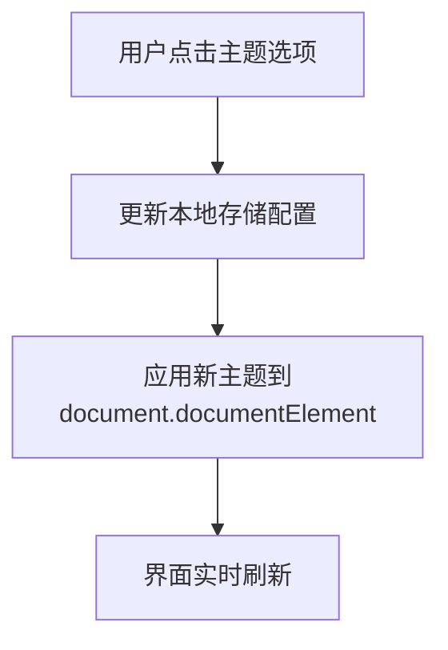

# 图像更换与配色调整设计方案

## 需求概述

根据用户反馈，需要对当前界面进行以下改进：
1. 更换现有配图（图标等视觉元素）
2. 将配色选择功能从设置模态框中移出，在主界面直接展示

## 当前状态分析

### 现有配图情况
通过代码审查发现，应用目前使用的图标库为 `lucide-react`，包含以下主要图标：
- `AlignLeft`：格式化功能图标
- `Minimize2`：压缩功能图标
- `Trash2`：清除功能图标
- `Wand2`：AI修复功能图标
- `Copy`：复制功能图标
- `Check`：已复制状态图标
- `MessageSquareOff`：去除注释功能图标
- `Settings`：设置功能图标
- `Code2`：应用Logo图标
- `AlertCircle`：错误提示图标
- `CheckCircle2`：成功提示图标
- `FileJson`：JSON文件类型图标
- `X`：关闭模态框图标
- `Save`：保存设置图标
- `AlertTriangle`：警告提示图标
- `Palette`：配色选择图标

### 配色选择现状
配色选择功能目前位于设置模态框内，用户需要点击设置齿轮图标才能访问。支持四种主题：
1. 深色主题 (dark)
2. 浅色主题 (light)
3. 蓝调主题 (blue)
4. 绿调主题 (green)

## 设计目标

### 目标一：优化配图效果
1. 保持现有功能不变的前提下，提升图标视觉效果
2. 确保新图标风格统一，符合现代UI设计理念
3. 保证在不同主题下图标的可读性和辨识度

### 目标二：重构配色选择功能位置
1. 将配色选择功能从设置模态框移至主界面可见区域
2. 提供直观的配色预览方式
3. 保持操作简便性，减少用户学习成本

## 具体设计方案

### 方案一：配图优化策略

#### 图标替换方案
考虑引入更现代化的图标库，如：
- `Tabler Icons`：简洁线条风格，提供更多细节表现力
- `Heroicons`：Tailwind CSS官方图标库，风格统一
- `Feather Icons`：轻量级矢量图标集合

推荐采用渐进式替换策略：
1. 保留用户熟悉的核心功能图标样式
2. 对部分辨识度不高或视觉效果欠佳的图标进行优先替换
3. 统一所有图标的描边宽度和圆角标准

#### 视觉增强措施
1. 增加图标悬停动效，提高交互反馈感
2. 根据功能重要性调整图标大小层次
3. 在特定状态下提供图标颜色变化反馈

### 方案二：配色选择功能重构

#### 功能迁移方案
将配色选择控件从设置模态框迁移到工具栏区域，具体位置建议：
- 放置在工具栏右侧，靠近设置齿轮图标的位置
- 或者放置在应用标题旁边，作为快速切换入口

#### UI设计规范
1. 采用卡片式设计展示所有可用主题
2. 当前选中主题以高亮边框标识
3. 每个主题选项显示对应的名称和颜色预览块
4. 支持点击切换，即时生效

#### 实现细节

#### 交互流程
1. 用户在主界面直接看到配色选择器
2. 点击任一主题选项立即切换界面主题
3. 切换结果自动保存至localStorage
4. 页面刷新后保持上次选择的主题

## 技术实施要点

### 图标系统改造
1. 引入新的图标库依赖项
2. 创建图标映射表，确保向后兼容性
3. 更新各组件中的图标引用

### 主题切换机制优化
1. 重构现有主题管理逻辑
2. 将主题选择组件从SettingsModal分离
3. 实现全局主题状态管理

### 样式适配处理
1. 确保新图标在各种主题下的可见性
2. 调整主题选择器在不同屏幕尺寸下的响应式表现
3. 优化动画过渡效果，避免突兀变化

## 风险评估与应对措施

### 潜在风险
1. 新图标库可能增加包体积
2. 不同浏览器对新图标的渲染可能存在差异
3. 用户可能需要适应新的界面布局

### 应对策略
1. 进行打包体积分析，必要时采用按需加载
2. 在主流浏览器上进行全面测试
3. 提供简短的新功能引导说明

## 验收标准

### 功能验收
1. 所有功能图标正常显示且语义清晰
2. 配色选择器在主界面正确展示
3. 主题切换功能响应迅速且持久化有效

### 视觉验收
1. 新图标风格统一协调
2. 各主题下界面元素对比度符合可访问性标准
3. 整体视觉层次更加清晰

### 性能验收
1. 页面加载时间无明显增长
2. 主题切换操作流畅无卡顿
3. 内存占用保持在合理范围内2. 主题切换操作流畅无卡顿
